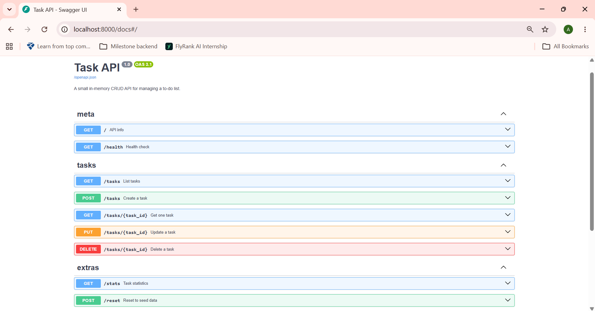
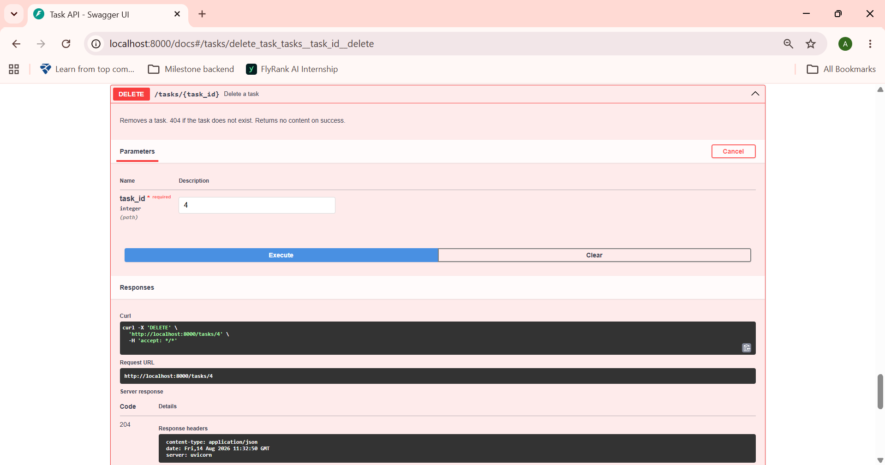

# Task API

A small, fully-tested CRUD API for managing a to-do list, built with **FastAPI**. Data lives in memory and resets on restart — this is Week 2 of an 8-week backend engineering track, before persistence is introduced.

## Overview

| | |
|---|---|
| **Framework** | FastAPI (Python) |
| **Storage** | In-memory list (no database yet) |
| **Docs** | Auto-generated Swagger UI at `/docs` |
| **Status** | All 4 CRUD operations implemented, validated, and tested |

## Quickstart

```bash
python3 -m venv venv
source venv/bin/activate      # Windows: venv\Scripts\activate
pip install -r requirements.txt
uvicorn main:app --reload
```

The API runs at `http://localhost:8000`. Interactive docs at `http://localhost:8000/docs`.

## Endpoints

| Method | Path           | Description                                       |
|--------|----------------|----------------------------------------------------|
| GET    | `/`            | API info                                            |
| GET    | `/health`      | Health check                                        |
| GET    | `/tasks`       | List all tasks — supports `?done=` and `?search=`   |
| GET    | `/tasks/{id}`  | Get a single task                                   |
| POST   | `/tasks`       | Create a task                                       |
| PUT    | `/tasks/{id}`  | Update a task                                       |
| DELETE | `/tasks/{id}`  | Delete a task                                       |
| GET    | `/stats`       | Task counts — total / done / open                   |
| POST   | `/reset`       | Restore the 3 seed tasks                            |

## Example

**Request**
```bash
curl -i -X POST http://localhost:8000/tasks \
  -H "Content-Type: application/json" \
  -d '{"title":"Buy milk"}'
```

**Response**
```
HTTP/1.1 201 Created
content-type: application/json

{"id":4,"title":"Buy milk","done":false}
```

## Status codes

| Code | Meaning                              |
|------|----------------------------------------|
| 200  | Successful read or update              |
| 201  | Task created                           |
| 204  | Task deleted, no body returned         |
| 400  | Invalid request body (missing/empty title) |
| 404  | Task id does not exist                 |

## Swagger UI

All endpoints, tested live through "Try it out":



Example of a tested request/response cycle:



## The mortality experiment

Tasks are stored in a plain Python list in memory. When the server restarts, that list is recreated from the 3 seed tasks — anything created during the previous run is gone. This is expected: there is no database yet, so nothing survives a restart. This observation is the exact reason Week 3 introduces persistent storage.

## Project structure

```
.
├── main.py           # the API — all endpoints, validation, and models
├── requirements.txt  # dependencies
└── README.md
```

## Author

Aila Nasir — Backend AI Engineering Track, FlyRank AI Internship
