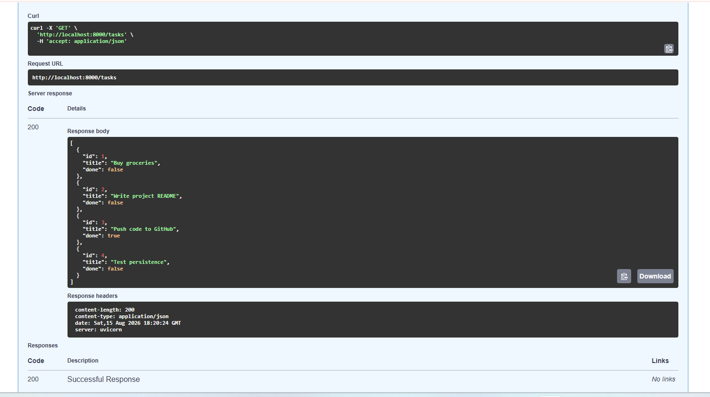
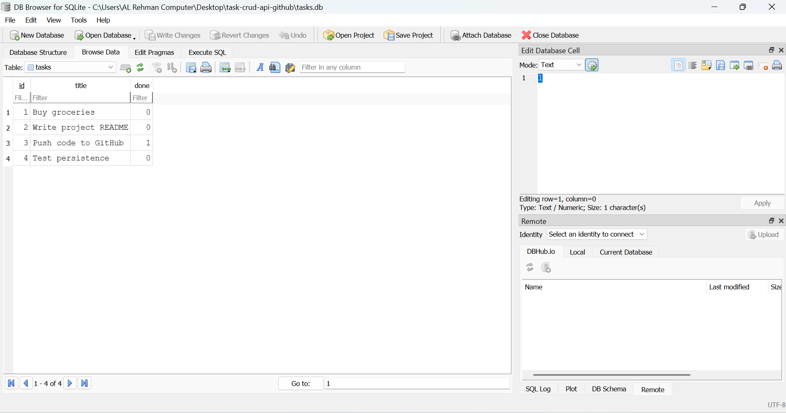
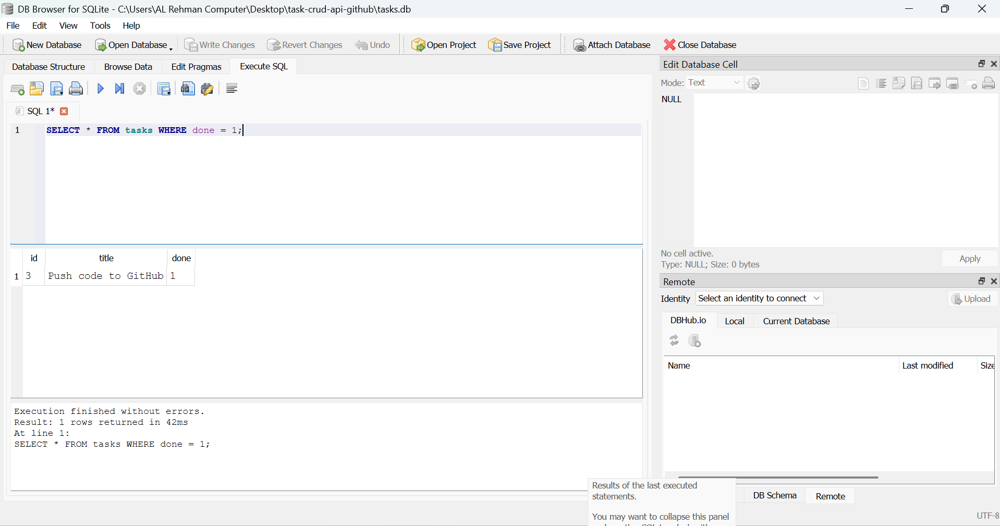

# Task API (SQLite-backed)

A CRUD API for managing a to-do list, built with FastAPI and backed by a real SQLite database. This is Week 3 (Assignment BE-02) of the FlyRank Backend AI Engineering track, extending the Week 2 in-memory version.

Data is now stored in `tasks.db`, so it survives server restarts.

## Why SQLite

SQLite needs no separate database server, it's a single file (`tasks.db`) that FastAPI reads and writes directly. That makes it the simplest way to prove the core idea of this assignment: swapping the storage layer without changing a single API endpoint, request, or response.

## Where the database file is stored

`tasks.db` is created automatically in the project's root folder the first time the app runs. It is not committed to GitHub (see `.gitignore`), since a database file is generated state, not source code.

## How to run it

```bash
python3 -m venv venv
source venv/bin/activate      # on Windows: venv\Scripts\activate
pip install -r requirements.txt
uvicorn main:app --reload
```

The API runs at `http://localhost:8000`. Interactive Swagger docs are at `http://localhost:8000/docs`.

## Endpoints

| Method | Path           | Meaning                          |
|--------|----------------|-----------------------------------|
| GET    | `/`            | API info                          |
| GET    | `/health`      | Health check                      |
| GET    | `/tasks`       | List all tasks (supports `?done=` and `?search=`) |
| GET    | `/tasks/{id}`  | Get a single task                 |
| POST   | `/tasks`       | Create a task                     |
| PUT    | `/tasks/{id}`  | Update a task                     |
| DELETE | `/tasks/{id}`  | Delete a task                     |
| GET    | `/stats`       | Task counts (total / done / open) |

These are identical to the Week 2 version. Only the storage layer changed, from an in-memory list to SQL queries against `tasks.db`.

## Example

```bash
curl -i -X POST http://localhost:8000/tasks \
  -H "Content-Type: application/json" \
  -d '{"title":"Buy milk"}'
```

```
HTTP/1.1 201 Created
content-type: application/json

{"id":4,"title":"Buy milk","done":false}
```

## Proof of persistence

Screenshot below shows `GET /tasks` returning a task that was created **before** the server was restarted, proving the data survived the restart instead of resetting like the Week 2 in-memory version did.



## Exploring the database directly

Opened `tasks.db` in DB Browser for SQLite and browsed the table directly:



Example SQL query executed manually, listing only completed tasks:

```sql
SELECT * FROM tasks WHERE done = 1;
```



## Status codes

- `200` - successful read/update
- `201` - task created
- `204` - task deleted, no body returned
- `400` - invalid request body (missing or empty title)
- `404` - task id does not exist

## Project structure

```
.
├── main.py           # the API, now with SQLite instead of an in-memory list
├── requirements.txt  # dependencies
├── README.md
└── screenshots/       # proof-of-work screenshots referenced above
```
